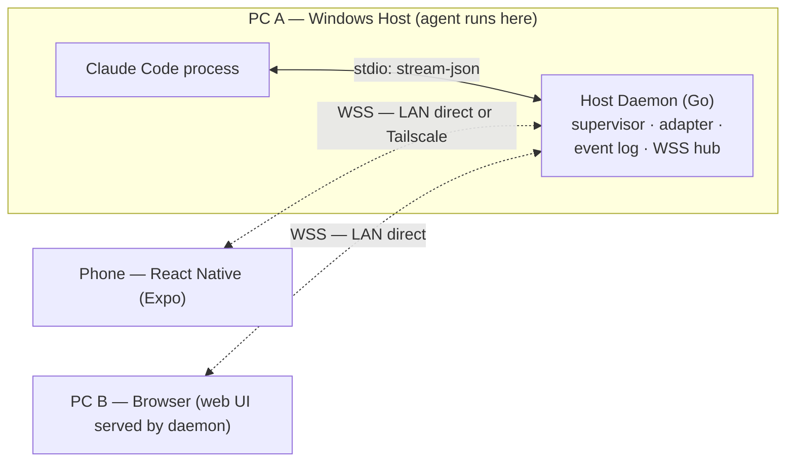

# MSclaudeConnector

**A multi-device harness for live coding-agent sessions.** Run Claude Code (later OpenAI Codex) on your Windows PC, walk away, and keep driving that *same live session* from another PC or your phone.

> **Status:** Phase 2 clients implemented — shared TS protocol package, embedded React web UI, and an Expo Android app. See [PLAN.md](PLAN.md) for the roadmap and [docs/PHASE2.md](docs/PHASE2.md) for what shipped.

---

## The Problem

A coding agent is running on **PC A**. You leave the desk. You want to open **PC B** or your **phone** and continue interacting with that exact session — watch it work, answer its questions, approve permissions, send the next prompt — without starting a new agent, and without the agent dying when a client disconnects.

## What It Is

- **One live session, many screens.** PC A owns the agent process and the authoritative state. PC B and the phone are clients — views + input devices, never separate agent instances.
- **Local-first.** No cloud backend, no accounts, no servers. LAN direct when you're home; Tailscale (WireGuard mesh) when you're not. Your code and conversations never leave your devices.
- **Agent-agnostic.** A Go `AgentAdapter` interface normalizes Claude Code (and later Codex) into one event stream; adding an agent means one adapter.
- **Crash-proof agents.** The agent is a child of the host daemon, not of any UI — close the app, the agent keeps running.

## How It Works



1. A **Go daemon** on PC A spawns Claude Code in structured headless mode (`--output-format stream-json`) and records everything in an append-only, seq-numbered event log — the single source of truth.
2. Clients pair once via QR (pinned TLS + per-device credentials), then receive a **snapshot + live tail** over WebSocket.
3. Commands (prompts, permission answers) go to the daemon, which assigns the order and broadcasts results to every screen — **first-write-wins**, with attribution.
4. Disconnected? The agent keeps going. Reconnect with `HELLO {lastSeq}` and catch up instantly.

## Documentation

| Doc | Contents |
|---|---|
| [PLAN.md](PLAN.md) | Locked decisions, tech stack, Phase 0–3 roadmap, POC gates, MVP scope, risks, backlog |
| [docs/ARCHITECTURE.md](docs/ARCHITECTURE.md) | Components, state ownership, sync protocol, networking, security model, alternatives considered |
| [docs/SYSTEM-DESIGN.md](docs/SYSTEM-DESIGN.md) | 8 Mermaid diagrams: system context, topology, pairing, prompt flow, permissions, resume, data model, adapters |
| [docs/PHASE2.md](docs/PHASE2.md) | Phase 2: Go gap fixes, protocol package, web UI, Expo app, Android TLS pinning, build/CI |

## Tech Stack

| Layer | Choice |
|---|---|
| Host daemon | Go (single Windows binary) — `coder/websocket`, `modernc.org/sqlite`, `grandcat/zeroconf`, Job Objects |
| Agent control | Claude Code stream-json over stdio (PTY scraping deferred; Codex post-MVP) |
| Phone | React Native (Expo dev-client) + TypeScript — Android first |
| PC B | React web UI embedded in the daemon (`embed.FS`) |
| Remote access | Tailscale free tier — **zero cloud infrastructure** |

## Roadmap Snapshot

- **Phase 0 — POCs (gate):** stream-json session viability (kill-gate) · RN WebSocket backgrounding · mDNS reliability · Windows process reaping
- **Phase 1 — Host core:** daemon, Claude adapter, event log, WSS hub, pairing
- **Phase 2 — Clients:** Expo Android app + embedded web UI sharing one protocol package
- **Phase 3 — Hardening:** Tailscale path, security pass, crash resilience

**MVP success test:** start a session on PC A → approve a permission and send a prompt from your phone on cellular → PC B's browser shows the same live state → close the app mid-run → the agent keeps going.

## Security

This product is, by design, a remote-control bridge to a coding agent — pairing *is* the security perimeter. One-time short-lived pairing tokens, physical confirmation on the host screen, per-device revocable credentials, pinned certificates, per-interface binding, and agent output always rendered as untrusted. Full model in [docs/ARCHITECTURE.md §7–8](docs/ARCHITECTURE.md).

## Repository Layout

```
MSclaudeConnector/
├── README.md                ← you are here
├── PLAN.md                  ← execution plan & roadmap
├── docs/
│   ├── ARCHITECTURE.md      ← architecture & tradeoffs
│   └── SYSTEM-DESIGN.md     ← mermaid system diagrams
├── cmd/harness              ← daemon CLI entrypoint
├── internal/
│   ├── agent/               ← AgentAdapter interface
│   │   ├── claude/          ← Claude Code stream-json adapter
│   │   └── mock/            ← deterministic adapter for tests
│   ├── auth/                ← pairing tokens + device credentials
│   ├── certutil/            ← self-signed TLS cert generation
│   ├── config/              ← daemon configuration
│   ├── discovery/           ← mDNS broadcaster
│   ├── hub/                 ← WSS sync hub
│   ├── logger/              ← structured logging
│   ├── netutil/             ← LAN IP discovery
│   ├── protocol/            ← versioned JSON message types
│   ├── store/               ← SQLite event log + device registry
│   ├── supervisor/          ← process supervisor (Windows Job Objects)
│   └── webui/               ← embedded React web UI bundle
├── clients/                 ← npm workspace (protocol + web; mobile standalone)
│   ├── packages/harness-protocol/   ← @harness/protocol: types, client, reducer
│   ├── apps/web/            ← @harness/web: React UI built into internal/webui/web
│   └── apps/mobile/         ← @harness/mobile: Expo Android app + native TLS module
├── Makefile · .nvmrc · .gitattributes · .github/workflows/ci.yml
└── go.mod / go.sum
```

## Quick Start (development)

```bash
# Build (Go only — the web bundle is committed)
go build -o harness ./cmd/harness

# Run with the mock agent (no Claude binary needed)
./harness serve --agent mock --dir /path/to/project --bind 127.0.0.1

# Run with real Claude (requires ANTHROPIC_API_KEY)
./harness serve --agent claude --dir /path/to/project

# Plaintext mode for trusted/private networks (dev convenience)
./harness serve --agent mock --insecure-http --bind 127.0.0.1

# Re-print a pairing QR with a fresh token
./harness pair --qr
```

The daemon prints a QR code and JSON blob containing addresses, port, token, and
the host's **SPKI** pin. Scanning the QR (phone) or opening
`https://<host>:7432/` (PC B) starts pairing; the host console then shows a
**4-character approval code** that must match the client's before you approve.
Tokens live 30 minutes by default (`--pair-ttl`; `0` = never expires). If stdin
is not a TTY, pair out-of-band with `./harness pair --approve <token>:<name>`.

## Building the clients

```bash
make web-install     # npm ci in clients/
make web-build       # build protocol + web into internal/webui/web
make web-verify      # typecheck + lint + vitest
make test            # protocol + web tests and go test ./... -race
make smoke           # real daemon + mock agent + real @harness/protocol client
```

The Expo app lives in `clients/apps/mobile` and is installed separately; see
[docs/PHASE2.md §2](docs/PHASE2.md).
