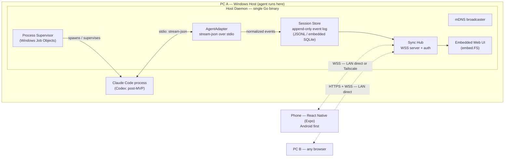
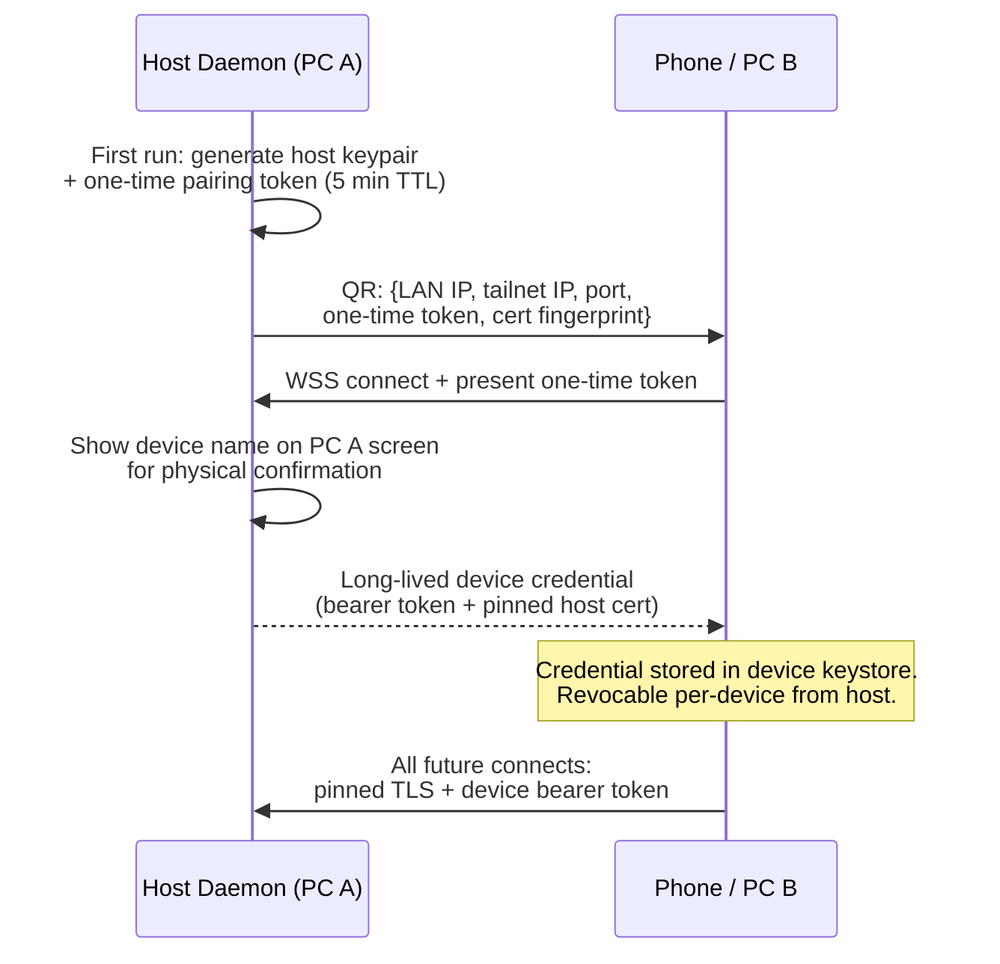
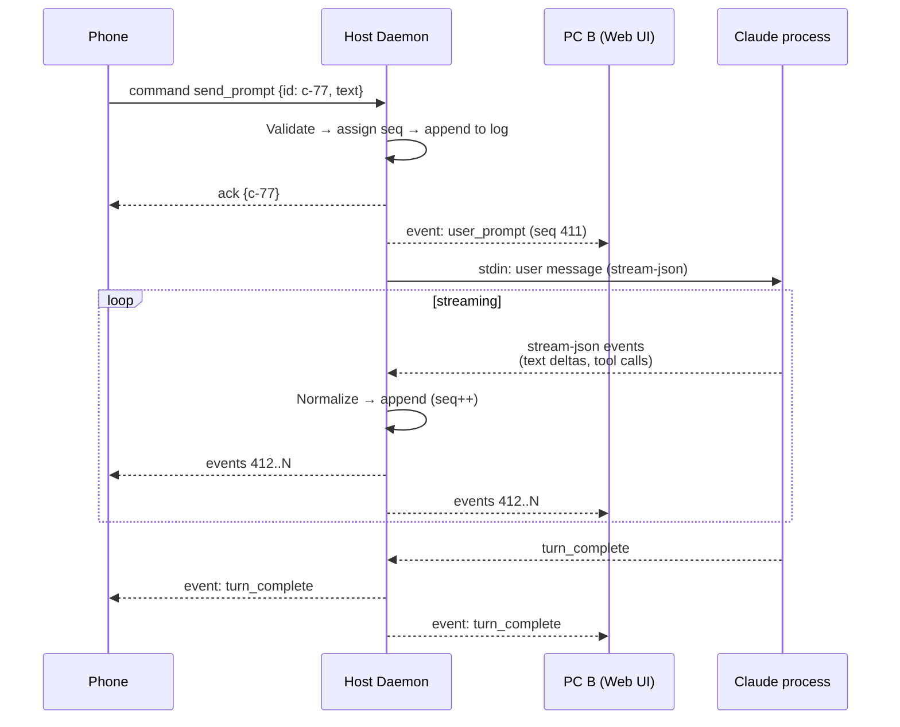
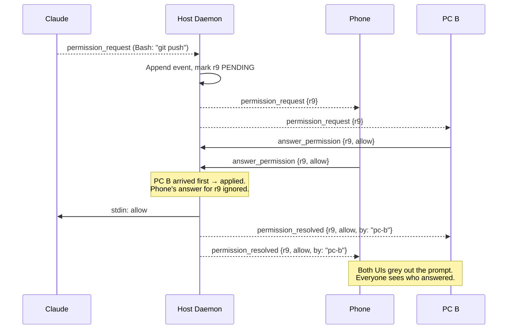
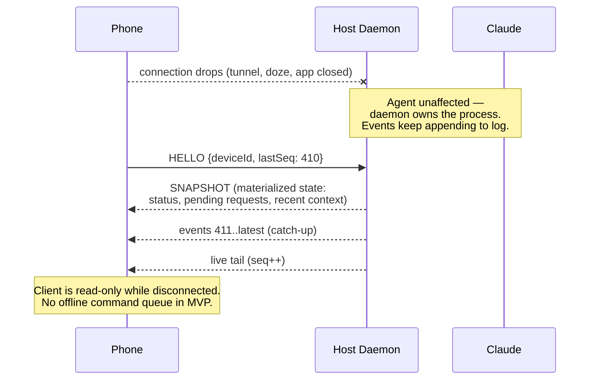
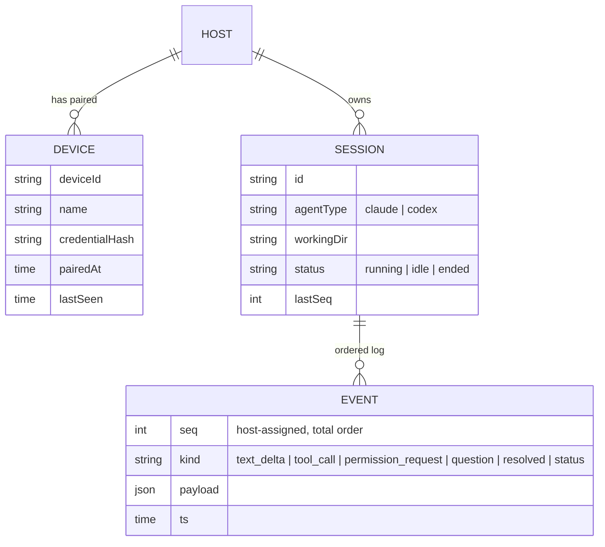
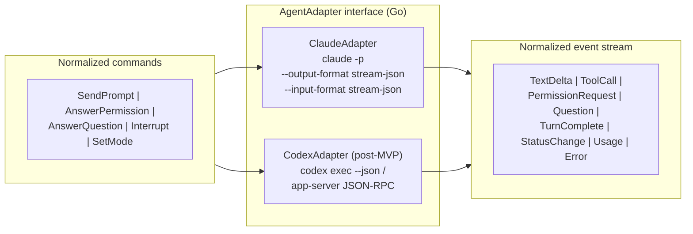

# SYSTEM-DESIGN.md — Multi-Device Coding-Agent Harness

**Last updated:** 2026-09-16
Companion docs: [../PLAN.md](../PLAN.md) · [ARCHITECTURE.md](ARCHITECTURE.md)

All diagrams are Mermaid — they render natively on GitHub and in VS Code (with a Mermaid extension), or paste into [mermaid.live](https://mermaid.live).

---

## 1. High-Level System Context



PC A is the single writer and single source of truth. Clients are views + input devices; the agent never runs anywhere else. The daemon owns the agent process, so clients can come and go freely.

---

## 2. Network Topology — LAN vs Remote (no cloud)

```mermaid
flowchart TB
    subgraph HOME["Same LAN (home / office)"]
        H1["PC A — Daemon :7432<br/>mDNS: _harness._tcp.local"]
        B1["PC B — Browser"]
        P1["Phone — Wi-Fi"]
        B1 -->|discover via mDNS<br/>WSS direct| H1
        P1 -->|QR scan or mDNS<br/>WSS direct| H1
    end
    subgraph AWAY["Different network (cellular)"]
        P2["Phone — 4G/5G"]
        H2["PC A — Daemon (tailnet IP)"]
        P2 <-->|WireGuard tunnel<br/>(Tailscale free tier)| H2
    end
```

Zero servers are owned or operated by this project. Tailscale is user-installed infrastructure, not our backend — no cloud DB, no relay, no accounts in MVP. Both paths terminate at the same WSS endpoint on the daemon with the same auth.

---

## 3. Sequence — Device Pairing (once per device)



Pairing is the entire security perimeter — the product is a remote-control bridge for a coding agent, so enrollment requires physical access to the host screen and produces short-lived one-time tokens, never reusable secrets.

---

## 4. Sequence — Prompt Flow (multi-client fan-out)



The host assigns every event a sequence number before broadcasting, so all clients observe the identical total order. A prompt sent from the phone appears on PC B as a normal stream event — clients never talk to each other.

---

## 5. Sequence — Permission Request (first-write-wins)



Pending actions are resolved exactly once, at the host, in arrival order. The resolution event carries the answering device's name so every screen shows the same outcome and its origin.

---

## 6. Sequence — Disconnect & Resume (agent keeps running)



Client lifetime is fully decoupled from agent lifetime. Resume costs one round trip: snapshot for derived state, then a catch-up tail from the client's last seen sequence number.

---

## 7. Data / State Model



Single writer (host) + total order (seq) ⇒ no CRDTs, no conflict resolution, trivial convergence. Materialized state (pending permissions, status) is rebuilt from the log on daemon restart, so the log is the only thing that must survive a crash.

---

## 8. Agent Adapter Abstraction



Clients and the sync hub only ever see normalized events — vendor specifics stop at the adapter. Adding a third agent means implementing one more adapter; nothing above this layer changes.
